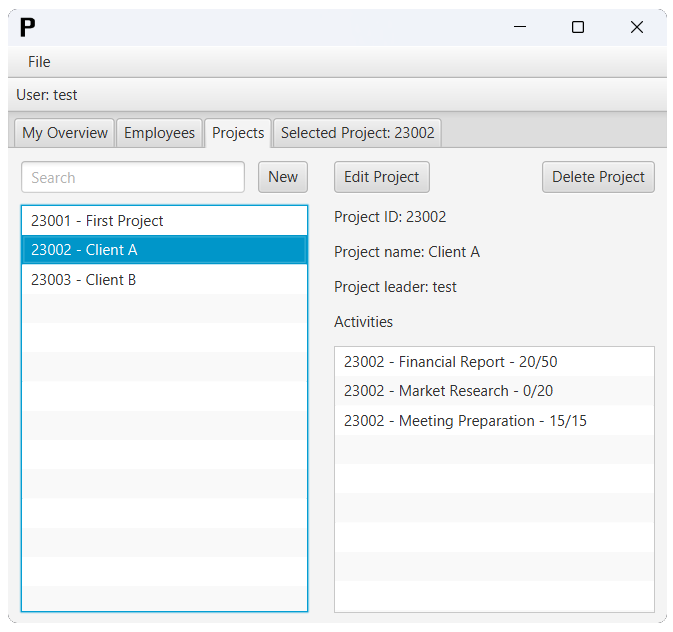

# Project Management System
Course: 02161 Software Engineering 1

This is a java program that helps users manage their employees and projects.
The program allows users to add employees, create new projects, assign employees to activities and register hours spent on them
The program also allows the user to appoint project leaders on projects and set estimated time on how long an activity should take.



# Running the program
You can run the program with the following ``Maven`` command:
```maven
mvn javafx:run
```
The project uses ``JavaFX``, and can not be run without it.

# Usage
## Login
When you run the program, you will see a graphical user interface. You will first need to login using your employee initials. By default, there is added an employee with initials "adm" which can be logged in as.


Once logged in you will be able to create new projects, add employees, create activities, assign employees to activities and appoint project leaders.
You can use the menu bar to navigate between the different sections of the program, My Overview, Employees, Projects and Selected Projects.

## My Overview
On My Overview you will see a list of all your specific projects and all your activities. Clicking on a project in the left list will select it, and the Selected Project tab will be available.

## Employees
On the Employees tab you can search in employees by initials. Selecting an employee will show which projects they are part of and which activities they have been assigned to. To add a new employee click "New". You will be prompted to enter the employees initials (1-4 letters).

## Projects
The Projects tab allows you to search for projects using either the name or ID. To edit a project, first select the project you wish to edit, then click the "Edit Project" button. This will take you to the Selected Project tab where you will now be able to create an activity and appoint a project leader for that project.

To create a new project click "New". You will be prompted to enter the project name. Once you have entered the name (1-30 characters) click OK button.

## Selected Project
On the tab Selected Project you can add activities to the selected project and appoint a project leader. 
To create an activity click the Create Activity button. This will prompt you to enter the activity name. When you have entered the activity name, you will now be able to assign an employee to that activity.
To do so select the created activity and click on the Assign Employee button and enter the initials of the employee you want to assign to the activity.

To appoint a project leader click on the Appoint Project Leader button. You will be prompted to initials of the employee you want to appoint project leader.
The tab Selected Projects now show the projects name on the left-hand side and the projects projects leader on the right.

## Loggin out
If you wish to log out of the system click the File button on the top-left corner and afterwards click Logout. Then you are returned to the login screen, where you can login as another employee, if they have been created.

# Tests
The ``Cucumber`` tests can be run using the following ``Maven`` command:
```maven
mvn clean test
```

# JAR File
We have built the project as a JAR file given in [ProjectManagement.jar](ProjectManagement.jar). It includes both the compiled .class files and the source .java files. It has to be run using a java installation with JavaFX:
```powershell
path\to\javafx\bin\java -jar ProjectManagement.jar
```